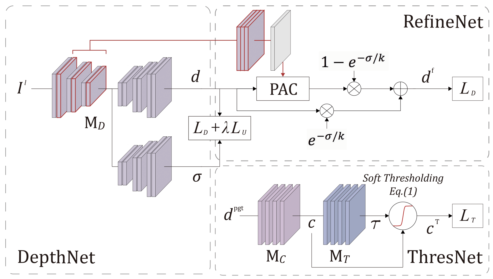

# Adaptive confidence thresholding for monocular depth estimation (ICCV21)

This is an official Pytorch implementation of the paper [Adaptive confidence thresholding for monocular depth estimation].(https://openaccess.thecvf.com/content/ICCV2021/papers/Choi_Adaptive_Confidence_Thresholding_for_Monocular_Depth_Estimation_ICCV_2021_paper.pdf):

```
@inproceedings{choi2021adaptive,
  title={Adaptive confidence thresholding for monocular depth estimation},
  author={Choi, Hyesong and Lee, Hunsang and Kim, Sunkyung and Kim, Sunok and Kim, Seungryong and Sohn, Kwanghoon and Min, Dongbo},
  booktitle={Proceedings of the IEEE/CVF International Conference on Computer Vision},
  pages={12808--12818},
  year={2021}
}
```
